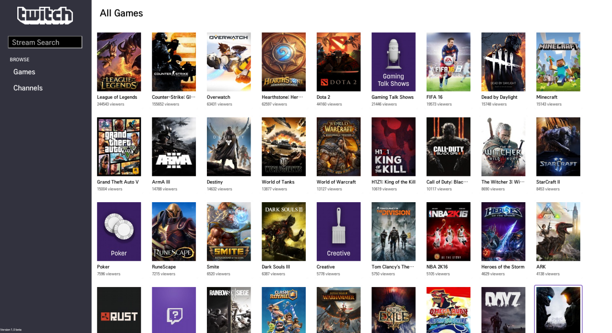
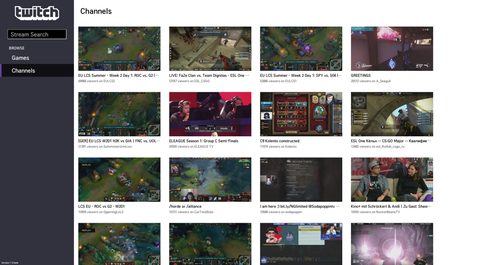

# Welcome to Twitch.TV!
I started the project, when i got a LG WebOS TV.

I wanted to watch stream on the TV, i had to connect it to my pc, and see the stream that way though.

I did that a few times, until it started to piss me off, so i started to look into, how to make my own Twitch.TV app, for the WebOS. It turned out it wasn't that complicated, so i stat down, and started the project.

## Installation
The App is avaiable in the lg store soon.

## Images

#### Updates
###### Update 1.0 beta
Added:

Removed:

#### ToDo
+ general remote
+ Stream chat
+ UI imporvements
++ nprogress